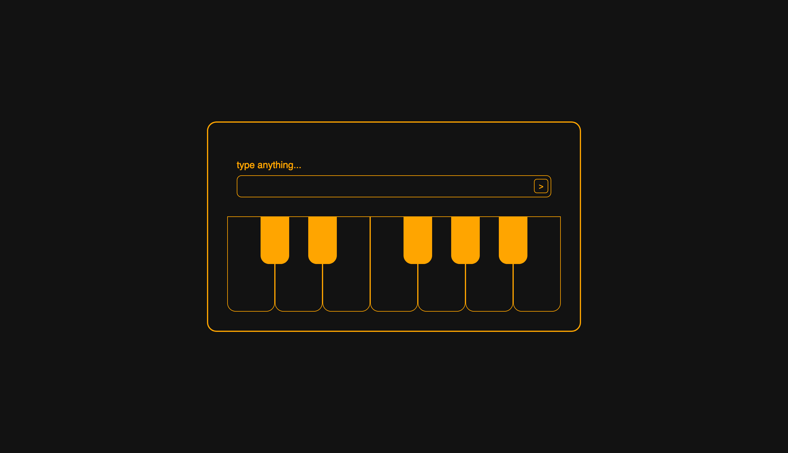

#  KeyWords - a quirky piano

## 🎹 Description
A tiny, but functional piano that converts words intro musical notes.   

## ✨ Features
- A simple UI
- User can enter a word or sentence and KeyWord will play the notes equivalent

## 🚀 Future Updates
- Responsive Design
- Play keys - with mouse/touch and keyboard
- Change octave
- Ear training mode